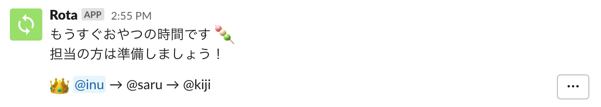
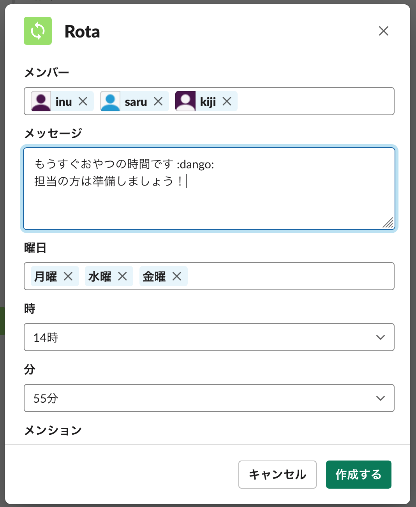
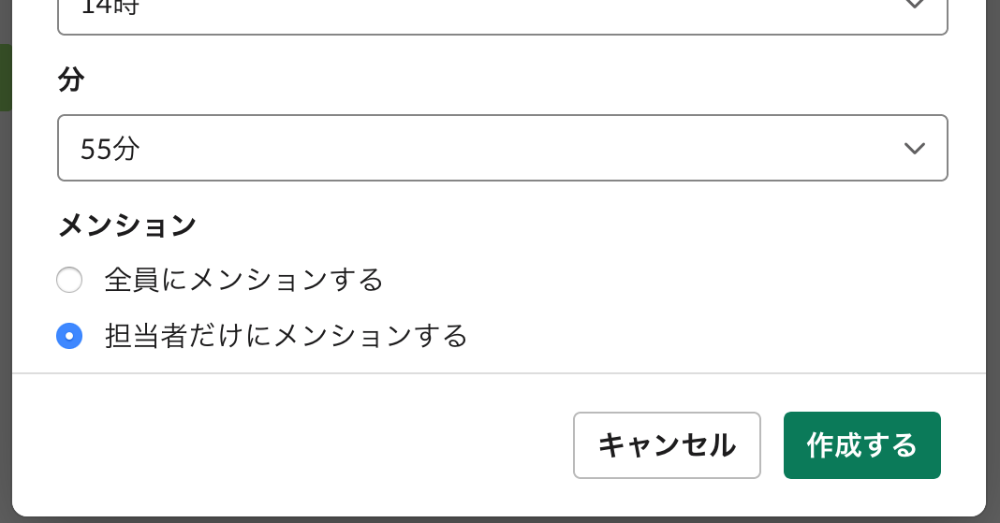
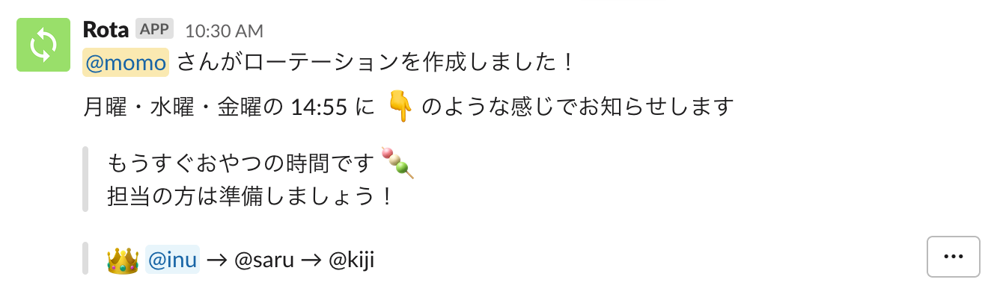
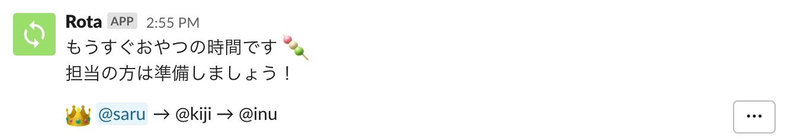

# Rota

日々のローテーションをお知らせする Slack アプリ



## 使い方

### ローテーションの作成

ローテーションをお知らせしたいチャンネルで、`/rota` コマンドを実行します。


すると、ローテーションを作成するためのモーダルが開きます。ローテーションを回すメンバーや、お知らせするメッセージ、曜日・時刻を入力しましょう。



お知らせ時にメンションする範囲を選ぶこともできます（スクロールで隠れていて少々わかりにくいですが…）。



[作成する] をクリックして完了です。「ローテーションを作成しました！」というメッセージが表示されます。



### Rota からのお知らせ

指定した日時になると、Rota が今日の担当者をお知らせします。


指定した日時がもう一度来ると、ローテーションがひとつ進み、次の担当者になります。以降も同様です。



右端の […] メニューから、手動でローテーションを進めたり、戻したりもできます。ローテーションの編集も、ここからできます。


### 補足

- メッセージ部分には [Slack の `mrkdwn` フォーマット](https://api.slack.com/reference/surfaces/formatting#basics)が使えます。作成モーダル上では整形表示されませんが、実際のお知らせではきちんと表示されます。
- 権限上、Rota はパブリックチャンネルのみで動作します。プライベートチャンネルや DM では利用できません。

## インストール

### Firebase プロジェクトの作成

まずは、アプリを動かすための Firebase プロジェクトを用意します。

1. [Firebase コンソール](https://console.firebase.google.com/)から、新規プロジェクトを作成

1. ⚙️ > プロジェクトを設定 > 全般 のページに移動し、デフォルトのリソースロケーションを `asia-northeast1`（東京）に設定

1. ⚙️ > 使用量と請求額 > 詳細と設定 のページに移動し、料金プランを Spark（無料）から Blaze（従量制）に変更

1. 開発 > Database のページに移動し、Cloud Firestore データベースを作成

1. [Firebase CLI](https://firebase.google.com/docs/cli) をインストール

   ```console
   $ npm install -g firebase-tools
   ```

1. 作成したプロジェクトを選択し、適当なエイリアス名を設定

   ```console
   $ firebase use --add
   ```

### Slack アプリの作成

1. [Bolt 入門ガイド](https://slack.dev/bolt-js/ja-jp/tutorial/getting-started) の「[アプリを作成する](https://slack.dev/bolt-js/ja-jp/tutorial/getting-started#%E3%82%A2%E3%83%97%E3%83%AA%E3%82%92%E4%BD%9C%E6%88%90%E3%81%99%E3%82%8B)」を参考にして、Slack アプリを作成

   1. [アプリ作成ページ](https://api.slack.com/apps?new_app=1) に移動
   1. 適当なアプリ名と、インストール先のワークスペースを入力し、アプリを作成
   1. Manage Distribution > Share Your App with Other Workspaces を開き、Remove Hard Coded Information のチェックを入れたら [Activate Public Distribution] をクリック
   1. Scopes > Bot Token Scopes に `chat:write`, `chat:write.public`, `commands`, `users:read` を追加

### Firebase へのデプロイ

Slack アプリの Basic Information > App Credentials の情報を Firebase に設定し、デプロイします。

1. Slack アプリの Client ID, Client Secret, Signing Secret を、Firebase Functions の `slack.*` に設定

   ```console
   $ firebase functions:config:set \
     slack.client_id="012345678.1234567..." \
     slack.client_secret="01234567890abcdef..." \
     slack.signing_secret="01234567890abcdef..."
   ```

1. Firebase Functions の `rota.*` に任意のランダム値を設定

   ```console
   $ firebase functions:config:set \
     rota.state_secret="state_secret" \
     rota.encryption_secret="encryption_secret"
   ```

1. Firebase にデプロイ 🚀

   ```console
   $ firebase deploy
   ```

### Slack アプリの追加設定

Slack から Firebase Functions を呼び出せるようにします。

1. 「[アクションの送信と応答](https://slack.dev/bolt-js/ja-jp/tutorial/getting-started#%E3%82%A2%E3%82%AF%E3%82%B7%E3%83%A7%E3%83%B3%E3%81%AE%E9%80%81%E4%BF%A1%E3%81%A8%E5%BF%9C%E7%AD%94)」を参考にして Interactivity を有効化

   1. Interactivity & Shortcuts の Interactivity を On に変更
   1. Request URL に `https://asia-northeast1-<FirebaseのプロジェクトID>.cloudfunctions.net/slack/events` と入力
   1. 設定を保存

1. Slash Commands を設定

   1. Slash Commands の [Create New Command] をクリック
   1. Command に `/rota` と入力
   1. Request URL に `https://asia-northeast1-<FirebaseのプロジェクトID>.cloudfunctions.net/slack/events` と入力
   1. 設定を保存

1. Redirect URLs を設定

   1. OAuth & Permissions の Redirect URLs に `https://asia-northeast1-<FirebaseのプロジェクトID>.cloudfunctions.net/slack/oauth_redirect` と入力して、[Add] をクリック
   1. [Save URLs] をクリックして設定を保存

1. Event Subscriptions を有効化

   1. Event Subscriptions の Enable Events を On に変更
   1. Request URL に `https://asia-northeast1-<FirebaseのプロジェクトID>.cloudfunctions.net/slack/events` と入力
   1. Subscribe to bot events に `user_change` を追加
   1. 設定を保存

### ワークスペースへのインストール

`https://asia-northeast1-<FirebaseのプロジェクトID>.cloudfunctions.net/slack/install` にアクセスして、ワークスペースにインストールします。

### 動作確認

以上で完了です。適当なパブリックチャンネル上で `/rota` コマンドを実行し、Rota が動作するか確認してください。

## 開発

### ローカル環境で動かす

[Firebase Emulator](https://firebase.google.com/docs/functions/local-emulator?hl=ja) で Functions と Firestore を起動します。

```console
$ cd functions/
$ firebase functions:config:get > .runtimeconfig.json
$ npm run serve
```

http://localhost:4000 で、Functions のログや Firestore の状態を確認することができます。`slack` 関数のエンドポイントは、http://localhost:5001/your-project-id/asia-northeast1/slack になります。

Slack からのイベントを受け取るためには、[ngrok](https://ngrok.com/) などを利用して、このエンドポイントを外部に公開する必要があります。別のターミナルで

```console
$ ngrok http 5001
```

を実行すると、https://12345abcde.ngrok.io のような URL で、http://localhost:5001 にアクセスできるようになります。Slack アプリの以下の設定に、ngrok の URL をそれぞれ指定しましょう。Firebase で動かす本番用 Slack アプリとは別に、開発用の Slack アプリを作成しておくと楽です。

- Interactivity & Shortcuts > Interactivity > Request URL
  - `https://12345abcde.ngrok.io/your-project-id/asia-northeast1/slack/events`
- Slash Commands > `/rota` > Request URL
  - `https://12345abcde.ngrok.io/your-project-id/asia-northeast1/slack/events`
- OAuth & Permissions > Redirect URLs
  - `https://12345abcde.ngrok.io/your-project-id/asia-northeast1/slack/oauth_redirect`
- Event Subscriptions > Request URL
  - `https://12345abcde.ngrok.io/your-project-id/asia-northeast1/slack/events`

[Cloud Functions シェル](https://firebase.google.com/docs/functions/local-shell?hl=ja)を使うと、Firebase Emulator 上の `cron` 関数を手動で実行することができます。

```console
$ npm start
firebase > cron()
'Successfully invoked function.'
```

### テスト

```console
$ npm run test
```

#### firebase-functions-test によるオンラインテスト

`functions/src/__tests__/index.test.ts` は[オンラインテスト](https://firebase.google.com/docs/functions/unit-testing?hl=ja#initializing)になっているため、Firebase 上にある実物の Firestore を使用します（一方、Functions はローカルで動作します）。以下の手順で、テスト用のプロジェクトを用意してください。

1. テスト用の Firebase プロジェクトを作成する
1. プロジェクトにウェブアプリを追加する
1. ⚙️ > プロジェクトを設定 > サービス アカウント > Firebase Admin SDK を表示し、[新しい秘密鍵の生成] をクリックする
1. ダウンロードした秘密鍵ファイルをリネームし、ルートディレクトリの `serviceAccountKey.json` に配置する
1. プロジェクト ID を `.env` ファイルの `TEST_PROJECT_ID` に設定する

## License

MIT

## Author

Masaya Nakamura (@mashabow)
